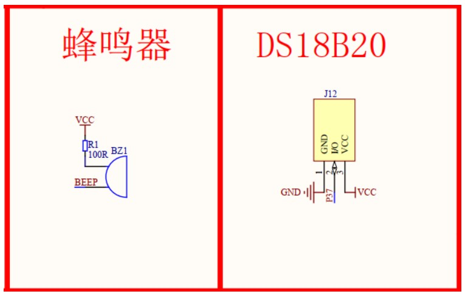

# TASK_17---DS18B20__Temperature_Sensor_Buzzer
 TASK_17---DS18B20__Temperature_Sensor_Buzzer

## TASK_17---DS18B20 Temperature Sensor & Buzzer interfacing

1. **Study the datasheet of DS18B20:** [link to DS18B20 datasheet](https://datasheets.maximintegrated.com/en/ds/DS18B20.pdf)
2. **Write a driver for the sensor:**
    * Read temperature and display on LCD, 7 segment displays and serial port at the same time.
    * Use a decimal point to display the decimal part of the temperature reading.
3. **Buzzer Alarm:**
    * If the temperature is higher than 37 degrees Celsius, sound the onboard buzzer (ON for 500ms, OFF for 500ms and repeat).
    * The buzzer present on the development kit is a passive buzzer, so you need to generate and supply an AC voltage to it.
    * Use a timer to toggle the buzzer pin at 4000 Hz. 
    * [Video on passive vs active buzzers](https://www.youtube.com/watch?v=dy5C_58kXEk)
4. **Dynamic Temperature Threshold:**
    * Send the temperature threshold value from Serial to STC microcontroller.
    * For example, if the value is 50, the buzzer should sound if the temperature reading goes beyond 50 degrees Celsius.

**Tips:**

1. Read temperature every second using a timer interrupt.
2. Use your body heat to raise the temperature of the sensor (limited to about 37 degrees Celsius).
3. For higher temperatures, you can use a matchstick (be careful not to burn anything). Consider using a lighter to avoid the smell of matches.
